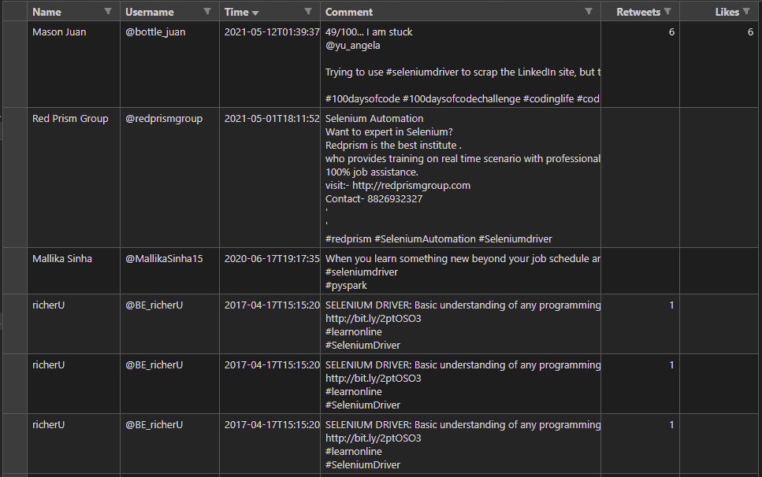

## Twitter bot
Twitter bot scrapes all the tweets from twitter which contains a search term provided by the user. The program retrieves the following from a tweet: 
* Name of user 
* Username
* Tweet itself
* Retweet count
* Likes count

All the data is saved in a csv file.

## Installation
### Prerequisites
**Python** 
``` 
https://www.python.org/

```
**Selenium** 
```
pip install selenium 
```
**Chrome web driver**
* Check your chrome version
```
chrome://version
 ```
*  Download the chrome driver matching your version
 ```
 https://chromedriver.chromium.org/downloads
 ```
### Steps
1. Clone this repository
   ```
   git@github.com:ckigenk/Twitter-bot.git
   ```
2. Edit the [bot/constants.py](https://github.com/ckigenk/Twitter-bot/blob/main/bot/constants.py) file:
   - PATH = copy the path to your chrome driver 
   - USERNAME = your twitter username
   - PASSWORD = your twitter password
   - SEARCH_TERM = what you want to search, any term or hashtag 

   ```
    PATH = r"" 
    URL="https://twitter.com/i/flow/login"
    USERNAME=""
    PASSWORD=""
    SEARCH_TERM=""
   ```
3. Run the [main.py](https://github.com/ckigenk/Twitter-bot/blob/main/main.py) file
   ```
   python main.py
   ```
   
## Sample output
**Screenshot of csv file containng tweet data** </img>

